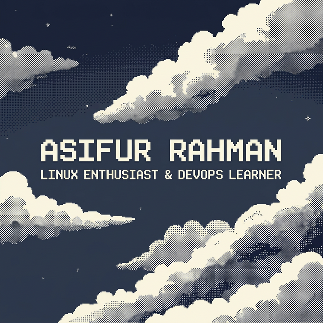
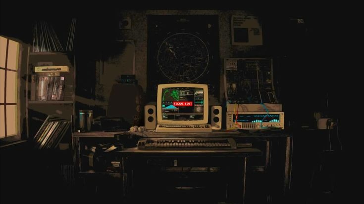

<!-- ═══════════════════════════════════════════════════════════════════════════
     🚀 ASIFUR RAHMAN — GitHub Profile README
     Theme: Dark Teal Monochrome | Inspired by the void between the stars
     ═══════════════════════════════════════════════════════════════════════════ -->

<!-- ╔══════════════════════════════════════════════════════════════════════╗
     ║  SECTION 1 — HERO BANNER + ANIMATED GREETING                       ║
     ╚══════════════════════════════════════════════════════════════════════╝ -->

<!-- UNCOMMENT when you upload hero_banner.png to the repo:
<div align="center">
  
</div>
-->


<div align="center">
  <a href="https://git.io/typing-svg">
    
  </a>
</div>

<!-- ╔══════════════════════════════════════════════════════════════════════╗
     ║  SECTION 2 — IDENTITY & CONTACT BADGES                             ║
     ╚══════════════════════════════════════════════════════════════════════╝ -->

<h3 align="center">A LINUX ENTHUSIAST 👨🏼‍🚀</h3>

<div align="center">

  <a href="mailto:asifur.rahman03@proton.me">
    
  </a>
  <a href="https://www.linuxfromscratch.org/" target="_blank">
    
  </a>
  <a href="https://github.com/as1furrahman" target="_blank">
    
  </a>

</div>

<br/>

<div align="center">
  
</div>

---

<!-- ╔══════════════════════════════════════════════════════════════════════╗
     ║  SECTION 3 — ABOUT ME                                              ║
     ╚══════════════════════════════════════════════════════════════════════╝ -->

<h2 align="center">🧑‍💻 About Me</h2>

<br/>

<div>

```yaml
name: Asifur Rahman
located_in: Bangladesh 🇧🇩
current_focus: Learning DevOps & Systems Engineering
passion: Linux, Open-Source, and building things from scratch
philosophy: "Keep it simple. Keep it minimal. Keep it powerful."
```

</div>

<br/>

<div align="center">

- 🐧 &ensp; I breathe **Linux** — from kernel modules to shell scripts
- 🧪 &ensp; Currently learning **DevOps** — Docker, CI/CD, Infrastructure as Code
- ⚙️ &ensp; I love building things **from scratch** — LFS, Neovim configs, automation
- 🎯 &ensp; Goal: **Master systems engineering** and contribute to open-source

</div>

---

<!-- ╔══════════════════════════════════════════════════════════════════════╗
     ║  SECTION 4 — LANGUAGES, FRAMEWORKS & TOOLS                         ║
     ╚══════════════════════════════════════════════════════════════════════╝ -->

<h2 align="center">🔧 Tech Arsenal</h2>

<br/>

<p align="center">
  <a href="https://skillicons.dev">
    
  </a>
</p>
<p align="center">
  <a href="https://skillicons.dev">
    
  </a>
</p>

<br/>

<div align="center">

  
  
  
  
  

</div>

---

<!-- ╔══════════════════════════════════════════════════════════════════════╗
     ║  SECTION 5 — GITHUB STATS                                          ║
     ╚══════════════════════════════════════════════════════════════════════╝ -->

<h2 align="center">📊 GitHub Analytics</h2>

<br/>

<div align="center">
  
</div>

<br/>

<div align="center">
  
</div>

---

<!-- ╔══════════════════════════════════════════════════════════════════════╗
     ║  SECTION 6 — QUOTE                                                  ║
     ╚══════════════════════════════════════════════════════════════════════╝ -->

<div align="center">

> *"An infinite number of monkeys typing into GNU Emacs would never make a good program."*
>
> **— Linus Torvalds**

</div>

---

<!-- ╔══════════════════════════════════════════════════════════════════════╗
     ║  SECTION 7 — FOOTER ART + FAREWELL                                 ║
     ╚══════════════════════════════════════════════════════════════════════╝ -->

<!-- UNCOMMENT when you upload footer.png to the repo:
<div align="center">
  
</div>
-->


<br/>

<div align="center">
  <a href="https://git.io/typing-svg">
    
  </a>
</div>

<br/>

<!-- ═══════════════════════════════════════════════════════════════════════════
     Built with 🖤 and too much terminal time.
     ═══════════════════════════════════════════════════════════════════════════ -->
