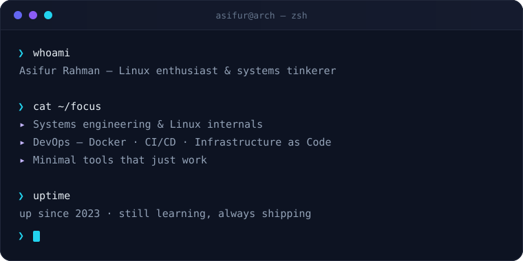
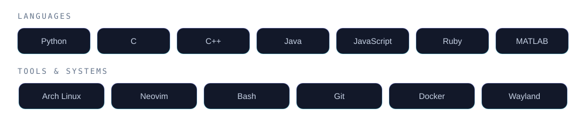

<!--
  ╔═══════════════════════════════════════════════════════════════════════════╗
  ║   ASIFUR RAHMAN  ·  GitHub Profile                                        ║
  ║   Design .......... modern gradient · clean · fully self-hosted           ║
  ║   Palette ......... bg #0A0E1A · surface #121829 · border #21283B         ║
  ║                     indigo #6366F1 · violet #8B5CF6 · cyan #22D3EE        ║
  ║                     ink #E6EDF3 · muted #94A3B8                           ║
  ║   Art ............. every graphic is a hand-made SVG in /assets           ║
  ║                     no third-party services — nothing can break           ║
  ╚═══════════════════════════════════════════════════════════════════════════╝
-->

  

  
  
  

  

<!-- ═══════════════════════════ ABOUT ═══════════════════════════ -->

<h2 align="center">About</h2>

  I'm a self-taught <strong>Linux enthusiast</strong> and systems tinkerer based in Dhaka, Bangladesh. 
  I build small, sharp tools and fix the quiet annoyances — from bringing dead laptop speakers 
  back to life under Linux to push-to-talk input on Wayland. 
  Right now I'm levelling up in <strong>DevOps</strong>: containers, pipelines and infrastructure as code.

  

  

<!-- ═══════════════════════════ TECH STACK ═══════════════════════════ -->

<h2 align="center">Tech Stack</h2>

  

  

<!-- ═══════════════════════════ PROJECTS ═══════════════════════════ -->

<h2 align="center">Featured Projects</h2>

| &nbsp; | Project | What it solves | Stack |
|:---:|:---|:---|:---:|
| 🔊 | **[Zenbook_CS35l41](https://github.com/as1furrahman/Zenbook_CS35l41)** | Brings the **CS35L41 speakers back to life** on the ASUS Zenbook UM5302TA under Linux | `Shell` |
| 🎙️ | **[voxtype](https://github.com/as1furrahman/voxtype)** | **Push-to-talk voice-to-text** for Wayland compositors | `Rust` |
| 🧩 | **[for-dina](https://github.com/as1furrahman/for-dina)** | A small, personal web project | `HTML` |

  <a href="https://github.com/as1furrahman?tab=repositories"><strong>→ Browse all repositories</strong></a>

  

<!-- ═══════════════════════════ ROADMAP ═══════════════════════════ -->

<h2 align="center">Roadmap</h2>

- [x] Daily-driving **Arch Linux**
- [x] Living in **Neovim**
- [x] **Shell scripting** and automation
- [x] Linux **hardware troubleshooting**
- [ ] **Docker** and containers
- [ ] **CI/CD** pipelines
- [ ] **Infrastructure as Code**
- [ ] Contributing to **open source**

  

<!-- ═══════════════════════════ CONNECT ═══════════════════════════ -->

<h2 align="center">Let's Connect</h2>

  I'm <strong>open to opportunities</strong> in Linux, systems and DevOps. 
  Got a gnarly systems problem, a project, or a role in mind? My inbox is open.

  <a href="mailto:asifur.rahman03@proton.me"><strong>asifur.rahman03@proton.me</strong></a>

  

<!-- ═══════════════════════════════════════════════════════════════════════════
     Built from scratch — every graphic hand-drawn in SVG.
     ═══════════════════════════════════════════════════════════════════════════ -->
